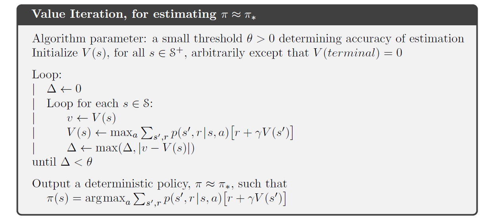
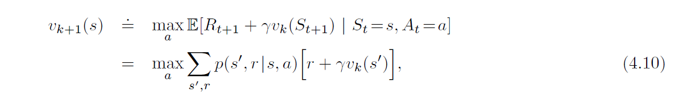
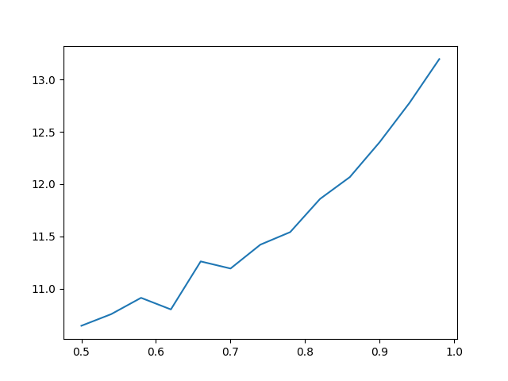

# DiceGame
An AI algorithm for playing dice game(dynamic programming)

## Description

MyAgent class defines an AI which plays the dice
game with the best strategy possible using the Value Iteration algorithm from the book[2]:


(Sutton et al., 2018, p. 83).

For storing utilities and optimal policy I used dictionaries, because they are basically hashtables what
allows to obtain its values in constant time. Initially it has 56 elements for every state as keys
and 0 as values. 
```python
utilities = {key: 0 for key in self.game.states}
```
The algorithm iterates over every state and action and computes the maximum expected 
utility with update Bellman equation[1]:



(Sutton et al., 2018, p. 83).

After finding best values for every state it calculates optimal deterministic policy, 
i.e. best action for every state.

### Statistics

The average score for 1000 games I get with random seed set to 'None' is
 **~13.35** 

The average amount of actions for every game out of
1000 games is approximately **~3.1**

The algorithm plays 1000 games in **~2.7 seconds** on average. 

cProfile analysis demonstrates that most time is being spent on 
numpy and scipy.stats procedures in the get_nex_states() function such as

| ncalls        | tottime           | percall  |  cumtime        | percall| filename:lineno(function)           |
| ------------- |:-------------:| -----:|  -------------:|:-------------:| ----------------:|
| 4928     | 0.157 | 0.000 |2.613| 0.001|dice_game.py:85(get_next_states)
|4312   | 0.297  |  0.000 |   1.007   | 0.000| shape_base.py:267(apply_along_axis)
|163496/48514  |  0.318  |  0.000  |  1.690  |  0.000 |{built-in method numpy.core._multiarray_umath.implement_array_function}

Hardware used for testing:
 - CPU - Intel Core i5,
 - RAM - 16 Gb
 - Storage - SSD Samsung Pro 850

### Optimal parameters
I managed to obtain the best average score with the following parameters:
 - discount factor. gamma = 0.99
 - theta = 0.01

The greater gamma doesn't affect the result considerably and does not change number of iterations.
The lower discount factor gives lower average score and fewer steps to converge. 
For example, if gamma set to 0.5, average score becomes ~11
Greater theta reduces number of steps at the price of precision of the average score.
If theta is equal to 0.1, then average score becomes slightly lower due to fewer steps for value iteration.
Lower theta produces more value iterations without significant improvement of the average score.

It takes approximately 10 value iterations to converge with gamma = 0.99 and theta = 0.01.

Here is the graph for gamma-average score correlation for 1000 games
x-axis - gamma from 0.5 to 0.99
y-axis - average score 



It can be seen from the plot that the closer gamma approximates 1 
the closer average score gets to its maximum.


### References:
1. Russell, S.J., Norvig, P., ed., 2010. Artificial intelligence : a modern approach [Online]. 3rd ed. 
   Upper Saddle River, New Jersey : Prentice Hall. Available from: https://www.proquest.com/ [Accessed 5 February 2021].
2. Sutton, R.S., Barto, A.G., 2018. Reinforcement Learning: An Introduction. Second edition. The MIT Press 
   Cambridge, Massachusetts London, England   

 
 
